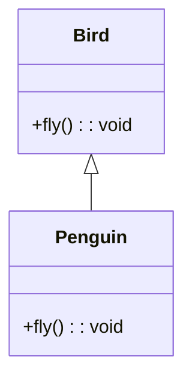
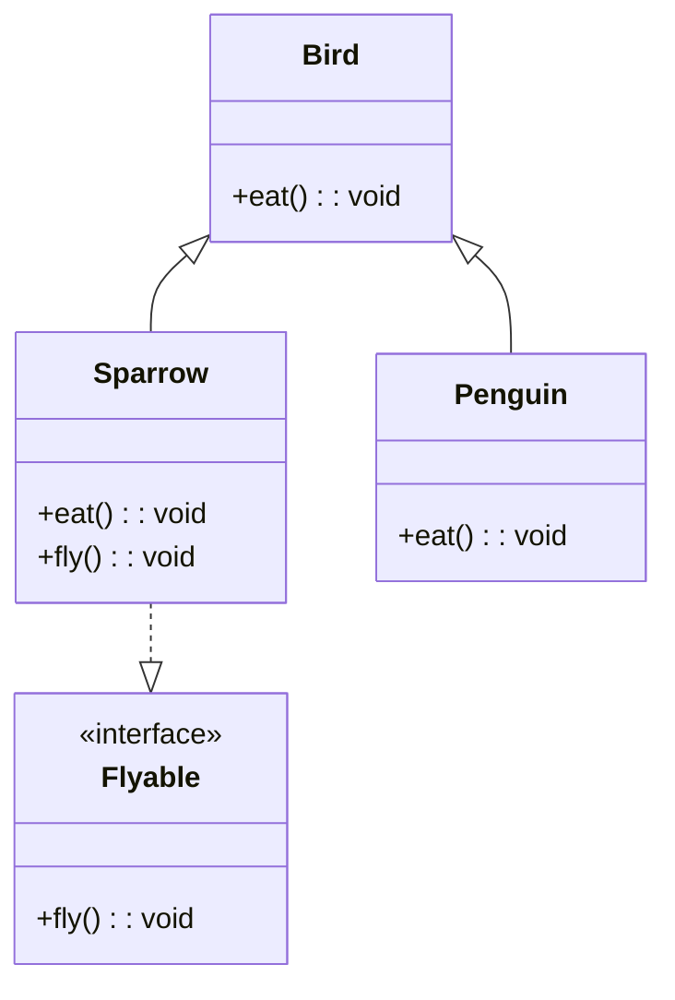
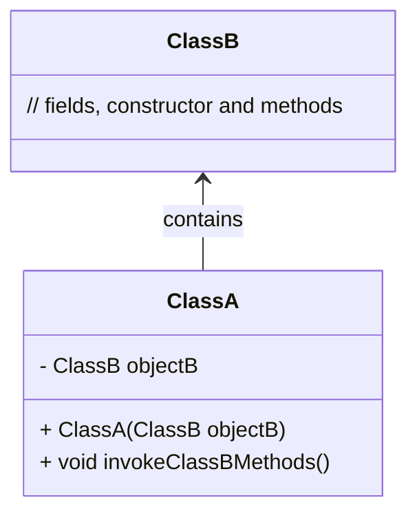
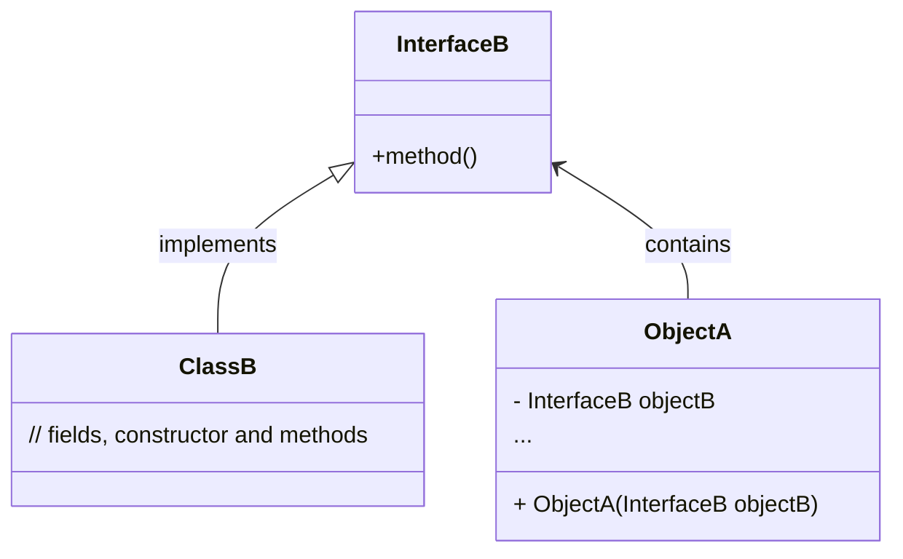
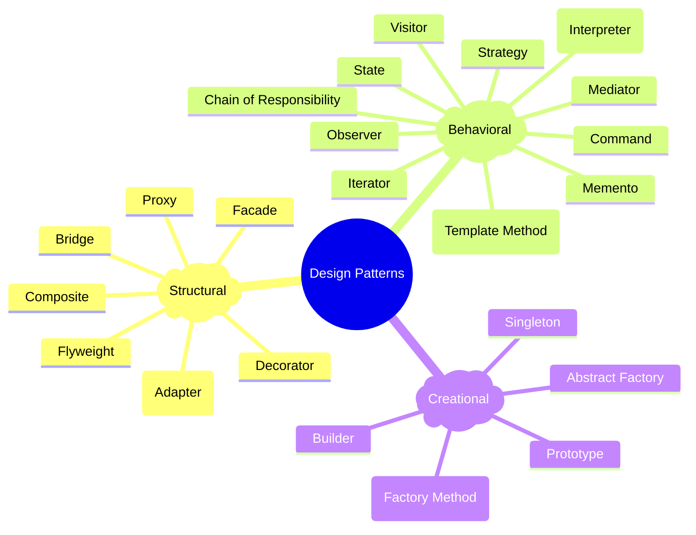
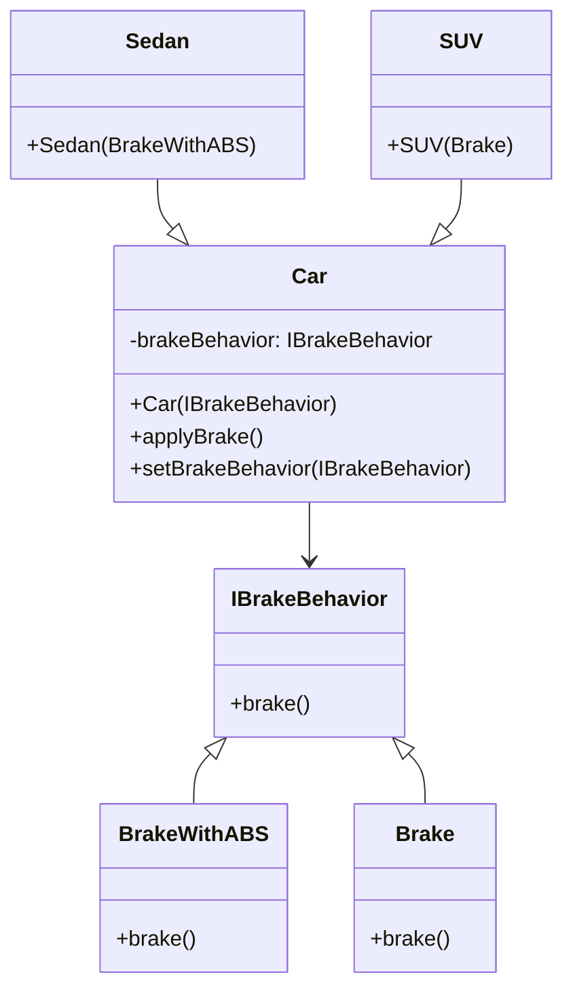
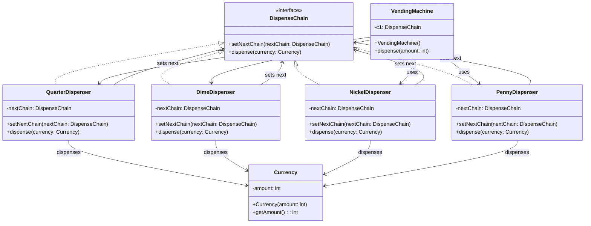
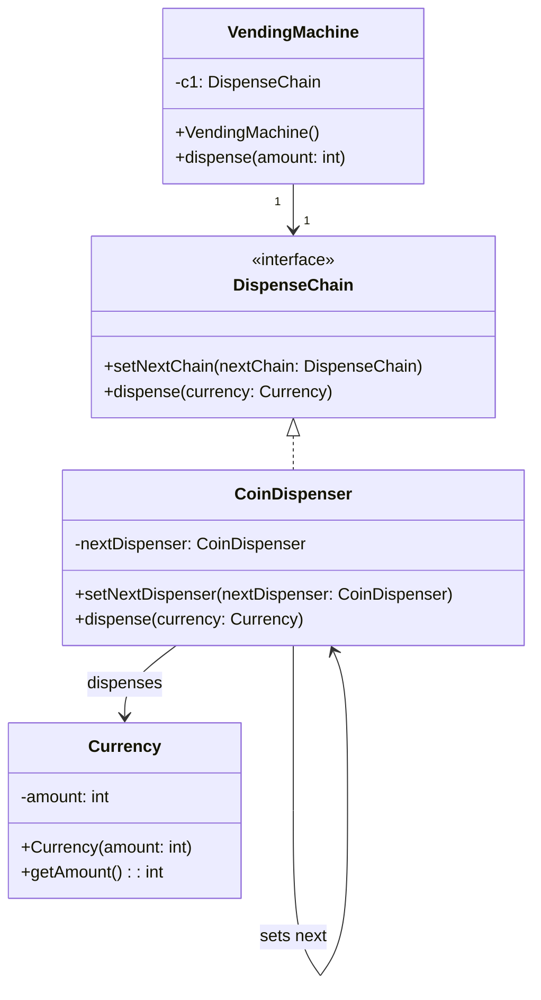
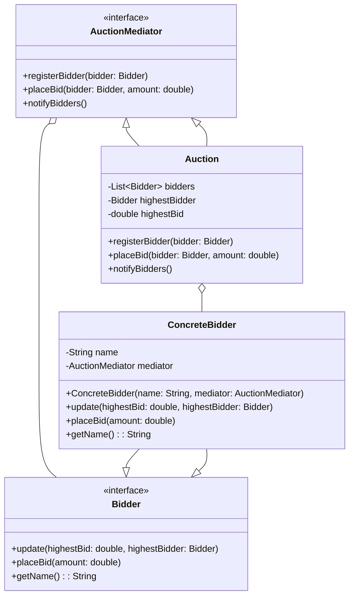

# SOLID Principles

## S - Single Responsibility Principle

A class should have only one reason to change.


Martin defines a responsibility as a *reason to change*, and concludes that a class or module should have one, and only one, reason to be changed (e.g. rewritten).

As an example, consider a module that compiles and prints a report. Imagine such a module can be changed for two reasons. First, the content of the report could change. Second, the format of the report could change. These two things change for different causes. The single responsibility principle says that these two aspects of the problem are really two separate [responsibilities](https://en.wikipedia.org/wiki/Interface_(computing)), and should, therefore, be in separate classes or modules. It would be a bad design to [couple](https://en.wikipedia.org/wiki/Coupling_(computer_programming)) two things that change for different reasons at different times.

The reason it is important to keep a class focused on a single concern is that it makes the class more robust. Continuing with the foregoing example, if there is a change to the report compilation process, there is a greater danger that the printing code will break if it is part of the same class.

Taken from : [https://en.wikipedia.org/wiki/Single-responsibility_principle#:~:text=The reason it is important,part of the same class](https://en.wikipedia.org/wiki/Single-responsibility_principle#:~:text=The%20reason%20it%20is%20important,part%20of%20the%20same%20class).

---

## O - Open Closed Principle

Open for extension closed for modification. A class which is throughly tested and live in production. Then it is not good to modify the class. Instead one can extend the class and do necessary modification.

> A class is closed, since it may be compiled, stored in a library, [baselined](https://en.wikipedia.org/wiki/Baseline_(configuration_management)), and used by client classes. But it is also open, since any new class may use it as parent, adding new features. When a descendant class is defined, there is no need to change the original or to disturb its clients.
> 

[https://en.wikipedia.org/wiki/Open–closed_principle](https://en.wikipedia.org/wiki/Open%E2%80%93closed_principle)

## L - Liskov Substitution Principle

When we substitute the parent class objects with the child class objects then the program should work without breaking.

1. **Definition**: The Liskov Substitution Principle states that objects of a superclass should be replaceable with objects of a subclass without affecting the correctness of the program.
2. **Key Idea**: Subtypes must be able to fulfill the contract of their base types, ensuring that derived classes can be used interchangeably with their base classes without introducing errors.
3. **Purpose**: To maintain reliable and predictable behavior in an object-oriented system by ensuring that subclass objects can substitute their superclass objects seamlessly.



```java
// Bird.java
public class Bird {
    public void fly() {
        System.out.println("Flying");
    }
}

// Penguin.java
public class Penguin extends Bird {
    @Override
    public void fly() {
        throw new UnsupportedOperationException("Penguins can't fly");
    }
}

// Main.java
public class Main {
    public static void main(String[] args) {
        Bird bird = new Bird();
        Bird penguin = new Penguin();

        bird.fly();       // Works fine
        penguin.fly();    // Throws exception, violating LSP
    }
}

```

---



```java
// Bird.java
public abstract class Bird {
    public abstract void eat();
}

// Flyable.java
public interface Flyable {
    void fly();
}

// Sparrow.java
public class Sparrow extends Bird implements Flyable {
    @Override
    public void eat() {
        System.out.println("Sparrow is eating");
    }

    @Override
    public void fly() {
        System.out.println("Sparrow is flying");
    }
}

// Penguin.java
public class Penguin extends Bird {
    @Override
    public void eat() {
        System.out.println("Penguin is eating");
    }

    // Penguins do not implement Flyable
}

// Main.java
public class Main {
    public static void main(String[] args) {
        Bird sparrow = new Sparrow();
        Bird penguin = new Penguin();

        sparrow.eat();     // Works fine
        ((Flyable) sparrow).fly();  // Works fine

        penguin.eat();     // Works fine
        // penguin cannot fly, no cast to Flyable, adhering to LSP
    }
}

```

## I - Interface Segregation Principle

https://www.baeldung.com/java-interface-segregation#doing_it_correct

This principle was first defined by Robert C. Martin as: “**Clients should not be forced to depend upon interfaces that they do not use**“.

The goal of this principle is to **reduce the side effects of using larger interfaces by breaking application interfaces into smaller ones**. It’s similar to the [Single Responsibility Principle](https://www.baeldung.com/java-single-responsibility-principle), where each class or interface serves a single purpose.

Precise application design and correct abstraction is the key behind the Interface Segregation Principle. **Though it’ll take more time and effort in the design phase of an application and might increase the code complexity, in the end, we get a flexible code.**

=== "Before"

  ```mermaid
  classDiagram
      class IPayment {
          +void initiatePayments()
          +Object status()
          +List<Object> getPayments()
          +void intiateLoanSettlement()
          +void initiateRePayment()
      }
      class LoanPayment {
          +void initiatePayments()
          +Object status()
          +List<Object> getPayments()
          +void intiateLoanSettlement()
          +void initiateRePayment()
      }
      class BankPayment {
          +void initiatePayments()
          +Object status()
          +List<Object> getPayments()
          +void intiateLoanSettlement() UnsupportedOperationException
          +void initiateRePayment() UnsupportedOperationException
      }

      IPayment <|-- BankPayment : implements
      IPayment <|-- LoanPayment : implements

  ```

=== "After"

  ```mermaid
  classDiagram

      class IPayment {
          +Object status()
          +List<Object> getPayments()
      }
      class IBank {
          +void initiatePayments()
      }
      class ILoan {
          +void initiateLoanSettlement()
          +void initiateRePayment()
      }
      class BankPayment {
          +void initiatePayments()
          +Object status()
          +List<Object> getPayments()
      }
      class LoanPayment {
          +void initiateLoanSettlement()
          +void initiateRePayment()
          +Object status()
          +List<Object> getPayments()
      }
      
      IPayment <|.. IBank : extends
      IPayment <|.. ILoan : extends
      IBank <|-- BankPayment  : implements
      ILoan <|-- LoanPayment  : implements
  ```

## D - Dependency Inversion Principle

Class should depend on interfaces rather than concrete classes.

**5. Why Is the Dependency Inversion Principle Important**

When we write code for applications, we might split our logic into multiple modules. Nonetheless, this will result in a code with dependencies. One motivation behind DIP is to prevent us from depending upon modules that often change. Concrete classes change frequently, while abstractions and interfaces change much less. For example, operations like bug fixing, code recompiling, or merging different branches will be much easier.

However, there is more to it. DIP is key to achieving loosely coupled and maintainable systems alongside concepts such as [Polymorphism](https://en.wikipedia.org/wiki/Polymorphism_(computer_science)) or [Dependency Injection](https://en.wikipedia.org/wiki/Dependency_injection).

Let’s look at the importance of DIP by observing cases where it is sometimes misplaced with other concepts.

https://www.baeldung.com/cs/dip — Must Read

Before



After



# Design Patterns

---

https://cs.lmu.edu/~ray/notes/designpatterns/

The fundamental of every design pattern is to separate out what changes over period of time from what remains constant.



## Strategy Design Pattern



```java
/* Encapsulated family of Algorithms
 * Interface and its implementations
 */
public interface IBrakeBehavior {
    public void brake();
}

public class BrakeWithABS implements IBrakeBehavior {
    public void brake() {
        System.out.println("Brake with ABS applied");
    }
}

public class Brake implements IBrakeBehavior {
    public void brake() {
        System.out.println("Simple Brake applied");
    }
}

/* Client that can use the algorithms above interchangeably */
public abstract class Car {
    private IBrakeBehavior brakeBehavior;

    public Car(IBrakeBehavior brakeBehavior) {
      this.brakeBehavior = brakeBehavior;
    }

    public void applyBrake() {
        brakeBehavior.brake();
    }

    public void setBrakeBehavior(IBrakeBehavior brakeType) {
        this.brakeBehavior = brakeType;
    }
}

/* Client 1 uses one algorithm (Brake) in the constructor */
public class Sedan extends Car {
    public Sedan() {
        super(new Brake());
    }
}

/* Client 2 uses another algorithm (BrakeWithABS) in the constructor */
public class SUV extends Car {
    public SUV() {
        super(new BrakeWithABS());
    }
}

/* Using the Car example */
public class CarExample {
    public static void main(final String[] arguments) {
        Car sedanCar = new Sedan();
        sedanCar.applyBrake();  // This will invoke class "Brake"

        Car suvCar = new SUV();
        suvCar.applyBrake();    // This will invoke class "BrakeWithABS"

        // set brake behavior dynamically
        suvCar.setBrakeBehavior( new Brake() );
        suvCar.applyBrake();    // This will invoke class "Brake"
    }
}
```

**Strategy pattern** (also known as the **policy pattern**) is a [behavioral](https://en.wikipedia.org/wiki/Behavioral_design_pattern) [software design pattern](https://en.wikipedia.org/wiki/Design_pattern_(computer_science)) that enables selecting an [algorithm](https://en.wikipedia.org/wiki/Algorithm) at runtime. Instead of implementing a single algorithm directly, code receives runtime instructions as to which in a family of algorithms to use.

As you see in Strategy pattern, we are trying to separate out dependency of brake from the main class  as much as possible by making various strategies to inject it dynamically based on client requirement so that in future if new requirement for brake comes, there will be minimal/no changes in existing code (Open closed Principle).

Here in the example, we are following constructor injection. Instead of creating the brake object we are just creating a reference at Car, according to the requirement new brake object is passed at the constructor.

https://en.wikipedia.org/wiki/Strategy_pattern

## Template Design Pattern

When we want all classes to follow a specific order of steps to process the task but need to provide some flexibility that each class can have their own logic in that specific step.

## Chain Of Responsibility

Allows multiple handlers to process a request without the sender needing to know which handler will ultimately process it.

### Example implementations

1. Vending Machine
2. ATM 
3. Logger in an application





## Mediator

It encourages loose coupling by keeping objects from referring to each other explicitly and allows them to *communicate through a mediator* object.

Examples

1. Airline Management System
2. Chat Application
3. Online Auction Management

This diagram includes the Auction Mediator pattern with the general components like `AuctionMediator`, `Auction`, `Bidder`, and `ConcreteBidder`.



Explanation of the Diagram

1. **AuctionMediator**: This is an interface that declares methods to register bidders, place bids, and notify bidders.
2. **Auction**: This is the concrete mediator class that implements the `AuctionMediator` interface. It maintains a list of bidders, tracks the highest bid and the highest bidder, and notifies bidders of updates.
3. **Bidder**: This is an interface that declares methods for updating bidders, placing bids, and getting the bidder's name.
4. **ConcreteBidder**: This is a concrete implementation of the `Bidder` interface. It interacts with the `AuctionMediator` to place bids and get notified of bid updates.

## Memento

Its a behavioural design pattern

*Why its required and when to use* : Provides an ability to revert the an object to a previous state i.e., UNDO capability

It doesn’t expose the object internal implementation