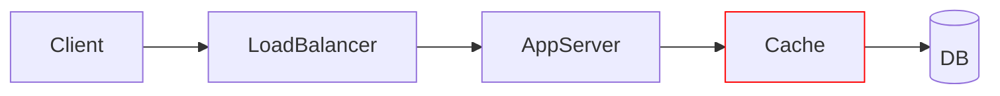
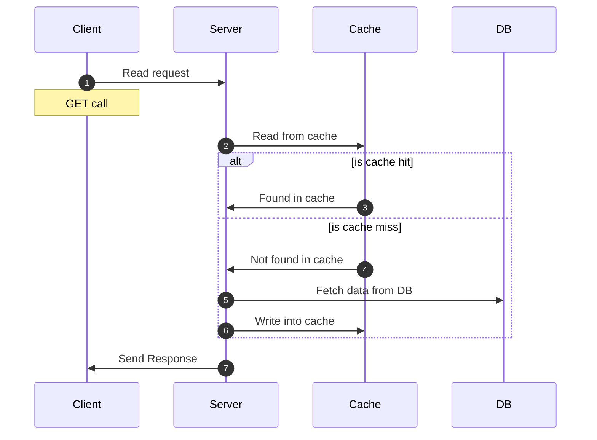
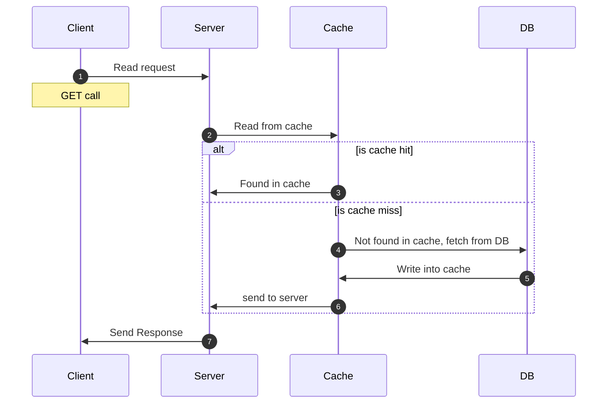
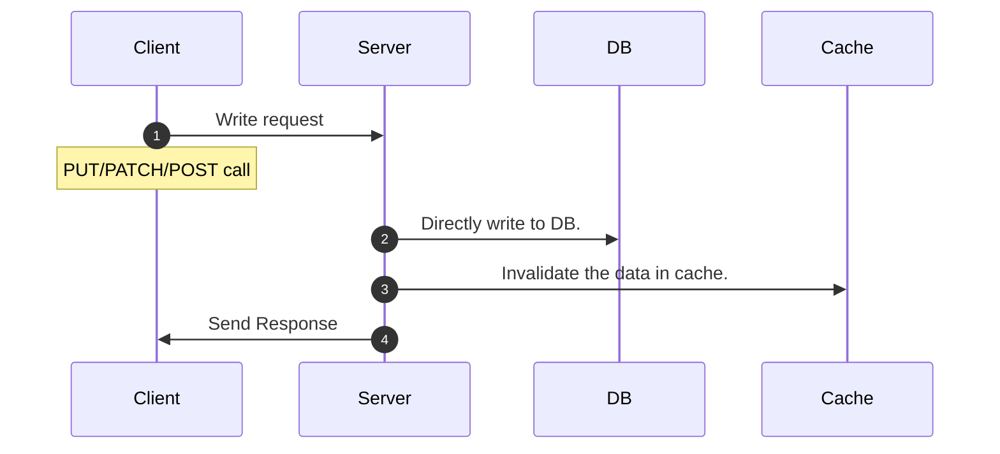
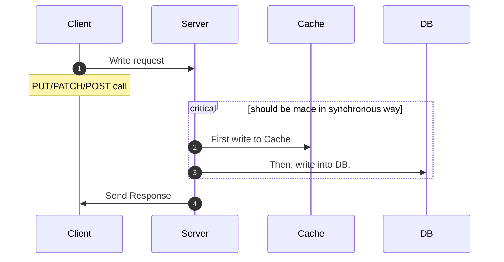
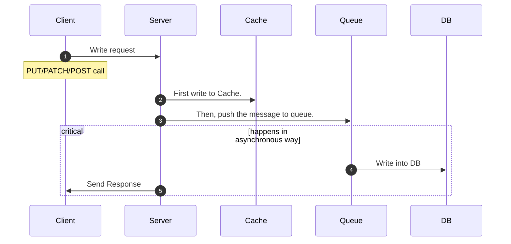

What is the need for caching?

1. Caching is a technique to store frequently used data in a fast access memory rather than accessing data every time from a slow access memory.
2. This makes our system fast.
3. It helps to reduce latency.
4. It also helps to achieve the fault tolerance.
5. There are different types of caching present at different layer of the system like:
    1. Client side caching (Browser caching)
    2. CDN (used to store the static data)
    3. Load balancer
    4. Server side application caching (like redis etc.)

Why single cache is not recommended? Need for distributed caching?

1. Possibility for single point failure
2. Scalability (After some point we can’t scale it up)

How distributed caching works?

1. We use consistent hashing technique to use them. 
2. There is a pool of cache servers

### Cache Aside

Application first check the cache.

If data found in the cache, it is a cache hit and data is returned to the client.

If data is not found in cache, it is a cache miss, application fetch the data from the DB, store it back to cache and data is returned to the client.

Pros:

1. Good approach for heavy read applications.
2. Even cache is down, request will not fail, as it will fetch the data from DB.
3. Cache document data structure can be different than the data structure (how DB stores) present in DB. (Both are independent).

Cons:

1. For new data read, there will always be CACHE-MISS first. ***(to resolve this, generally we can pre-hit the cache).***
2. Without appropriate caching is not used during write operation, There is a chance of inconsistency between cache and DB.

### Read through cache

1. Application first check the cache.
2. If data found in cache, it is called cache hit and data is returned to the client.
3. If data is not found in cache, it is called cache miss. Cache library itself fetch the data from DB, store it back to cache and data is returned to the application.

Pros:

1. Good approach for heavy read applications.
2. Logic of fetching the data from the DB and updating cache is seperated from the application.

Cons:

1. For new data read, there will always be CACHE-MISS first (to resolve this, generally we can pre-hit the cache).
2. If appropriate caching is not used during write operation, then there is a chance of inconsistency between cache and DB.
3. Cache document structure should be same as DB table.

 

### Write around cache

1. Directly writes data into the DB.
2. It do not update the cache.

Pros:

1. Good approach for heavy read applications.
2. Resolves inconsistency problem between cache and DB.

Cons:

1. For new data read, there will always be CACHE-MISS first (to resolve this, generally we can pre-hit the cache).
2. **If DB is down, write operation will fail.**

### Write Through Cache

1. First writes data into the cache.
2. In synchronous way writes data into the DB.
3. If DB fails, then cache should also be rolled back.

Pros:

1. Cache and DB always remain consistent.
2. Cache hit chance increases a lot.

Cons:

1. Alone it is not useful, it will increase the latency. (thats why it is always used with read through or cache aside cache).
2. 2 Phase commit need to be supported with this to maintain the transactional property.
3. If DB is down, write operation will fail. ( this not fully fault tolerant)

### Write back (behind) cache

1. First writes data into the cache.
2. Then in **asynchronous** writes data into the DB.

 

Pros:

1. Good for write heavy application.
2. Improves the write operation latency as writing into the DB happens asynchronously.
3. Cache hit chance increases a lot.
4. Gives much better performance when used with read through cache.
5. Even if DB fails, write operation will still works.

Cons:

1. If data is removed from cache and DB write still not happens, then there is a chance of an issue. ( it is handled by keeping the TAT of cache little higher like 2 days)