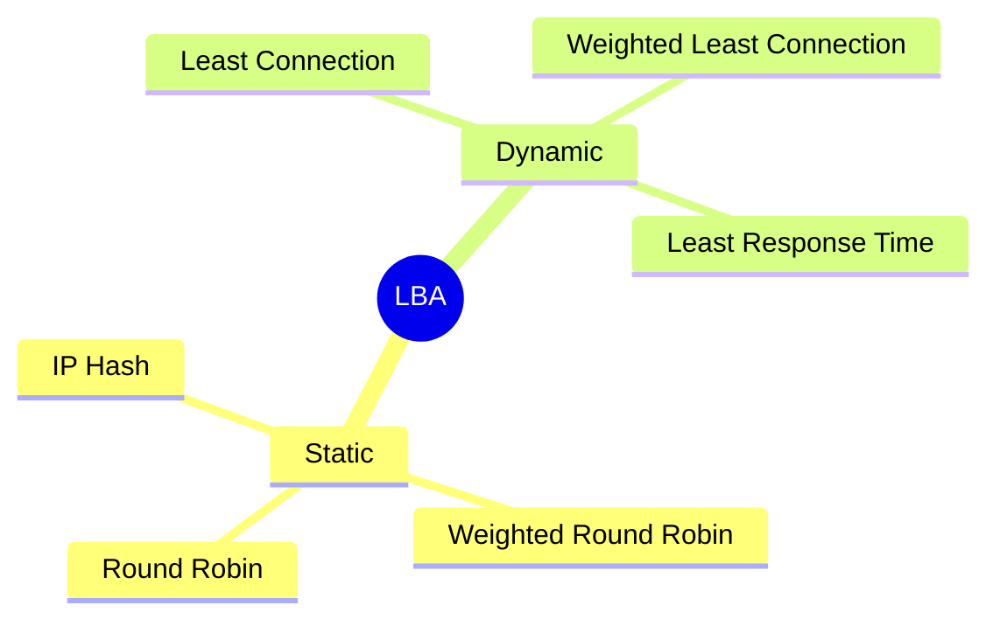

```mermaid
mindmap
  root((LBA))
    Static
      Round Robin
      Weighted Round Robin
      IP Hash
    Dynamic
      Least Connection
      Weighted Least Connection
      Least Response Time
``` 
