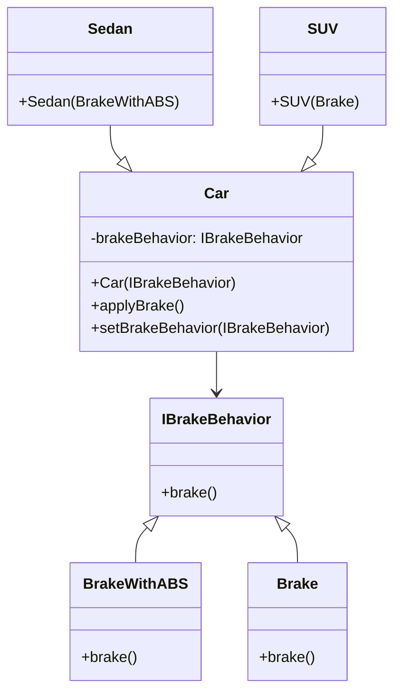

# Strategy Design Pattern



```java 
/* Encapsulated family of Algorithms
 * Interface and its implementations
 */
public interface IBrakeBehavior {
    public void brake();
}

public class BrakeWithABS implements IBrakeBehavior {
    public void brake() {
        System.out.println("Brake with ABS applied");
    }
}

public class Brake implements IBrakeBehavior {
    public void brake() {
        System.out.println("Simple Brake applied");
    }
}

/* Client that can use the algorithms above interchangeably */
public abstract class Car {
    private IBrakeBehavior brakeBehavior;

    public Car(IBrakeBehavior brakeBehavior) {
      this.brakeBehavior = brakeBehavior;
    }

    public void applyBrake() {
        brakeBehavior.brake();
    }

    public void setBrakeBehavior(IBrakeBehavior brakeType) {
        this.brakeBehavior = brakeType;
    }
}

/* Client 1 uses one algorithm (Brake) in the constructor */
public class Sedan extends Car {
    public Sedan() {
        super(new Brake());
    }
}

/* Client 2 uses another algorithm (BrakeWithABS) in the constructor */
public class SUV extends Car {
    public SUV() {
        super(new BrakeWithABS());
    }
}

/* Using the Car example */
public class CarExample {
    public static void main(final String[] arguments) {
        Car sedanCar = new Sedan();
        sedanCar.applyBrake();  // This will invoke class "Brake"

        Car suvCar = new SUV();
        suvCar.applyBrake();    // This will invoke class "BrakeWithABS"

        // set brake behavior dynamically
        suvCar.setBrakeBehavior( new Brake() );
        suvCar.applyBrake();    // This will invoke class "Brake"
    }
}
```

**Strategy pattern** (also known as the **policy pattern**) is a [behavioral](https://en.wikipedia.org/wiki/Behavioral_design_pattern) [software design pattern](https://en.wikipedia.org/wiki/Design_pattern_(computer_science)) that enables selecting an [algorithm](https://en.wikipedia.org/wiki/Algorithm) at runtime. Instead of implementing a single algorithm directly, code receives runtime instructions as to which in a family of algorithms to use.

As you see in Strategy pattern, we are trying to separate out dependency of brake from the main class  as much as possible by making various strategies to inject it dynamically based on client requirement so that in future if new requirement for brake comes, there will be minimal/no changes in existing code (Open closed Principle).

Here in the example, we are following constructor injection. Instead of creating the brake object we are just creating a reference at Car, according to the requirement new brake object is passed at the constructor.

[Reference Site](https://en.wikipedia.org/wiki/Strategy_pattern)