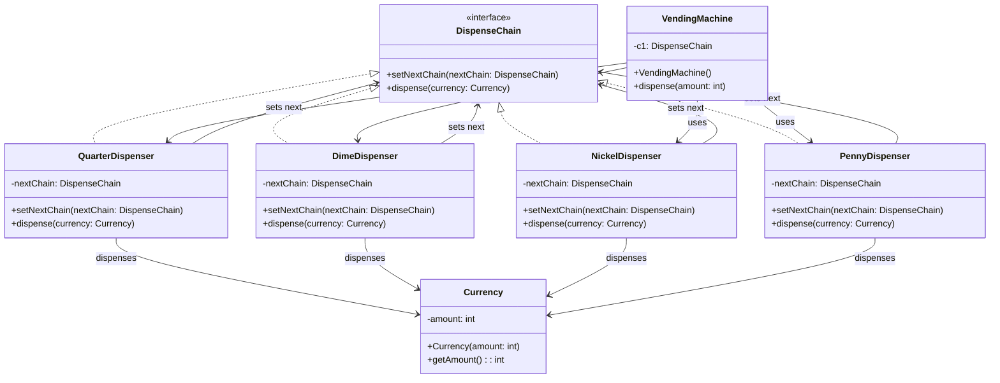
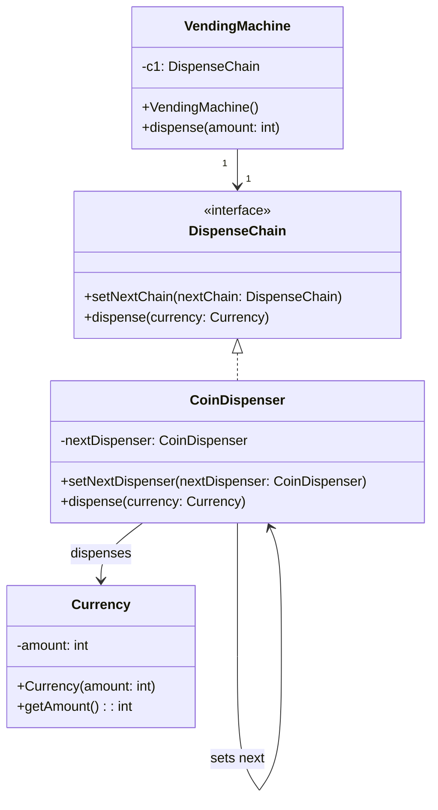

# Chain Of Responsibility

Allows multiple handlers to process a request without the sender needing to know which handler will ultimately process it.

## Example implementations

1. Vending Machine
2. ATM 
3. Logger in an application

