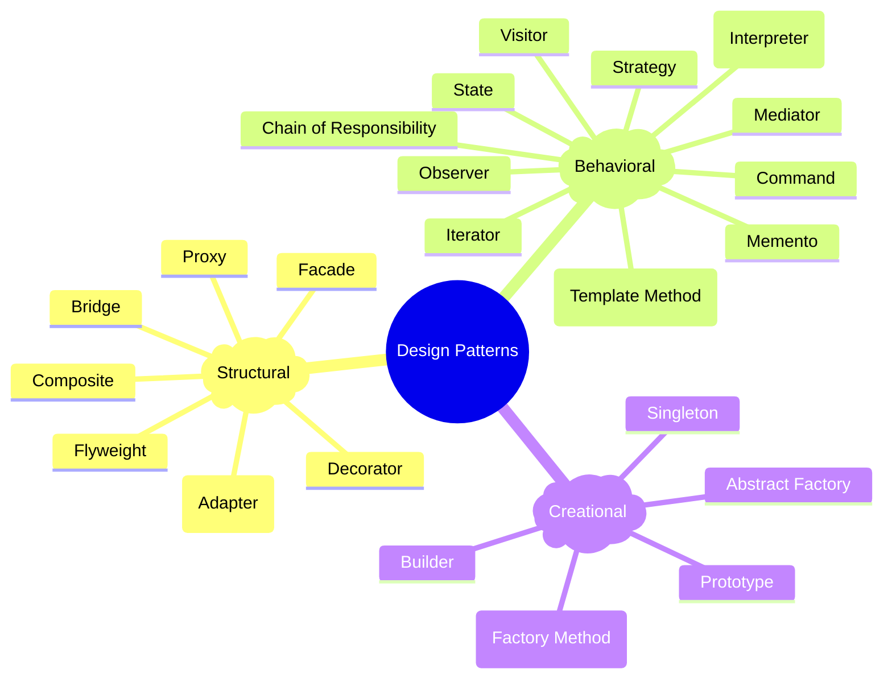

# Design Patterns

---

[Reference](https://cs.lmu.edu/~ray/notes/designpatterns/)

The fundamental of every design pattern is to separate out what changes over period of time from what remains constant.

  Design Pattern   | Intent
  -----------------|--------------
  Observer Pattern | Any change in the observable should be communicated to the observers
  Mediator Pattern | Two classes can't communicate directly
  Factory Pattern  | Creation of an object is based on a condition

