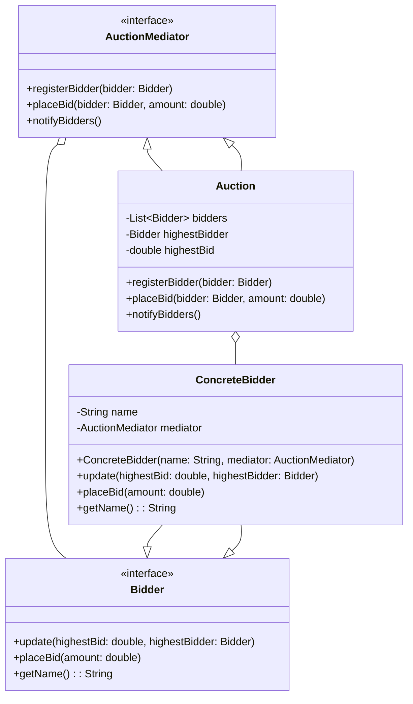

# Mediator Design Pattern
 
It encourages loose coupling by keeping objects from referring to each other explicitly and allows them to *communicate through a mediator* object.

Examples

1. Airline Management System
2. Chat Application
3. Online Auction Management

This diagram includes the Auction Mediator pattern with the general components like `AuctionMediator`, `Auction`, `Bidder`, and `ConcreteBidder`.

Explanation of the Diagram

1. **AuctionMediator**: This is an interface that declares methods to register bidders, place bids, and notify bidders.
2. **Auction**: This is the concrete mediator class that implements the `AuctionMediator` interface. It maintains a list of bidders, tracks the highest bid and the highest bidder, and notifies bidders of updates.
3. **Bidder**: This is an interface that declares methods for updating bidders, placing bids, and getting the bidder's name.
4. **ConcreteBidder**: This is a concrete implementation of the `Bidder` interface. It interacts with the `AuctionMediator` to place bids and get notified of bid updates.