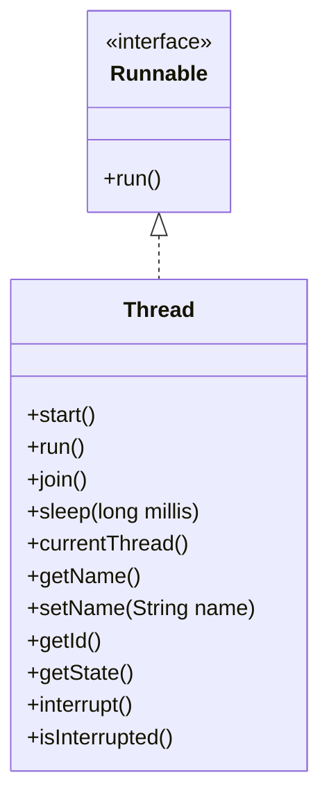

# Threads Basics

A thread can be created using 2 methods
 - extending thread class
 - implementing runnable interface

Runnable interface is a functional interface.

```mermaid
classDiagram
    class Runnable {
        <<interface>>
        +run()
    }

    class Thread {
        +start()
        +run()
        +join()
        +sleep(long millis)
        +currentThread()
        +getName()
        +setName(String name)
        +getId()
        +getState()
        +interrupt()
        +isInterrupted()
    }

    Runnable <|.. Thread

```